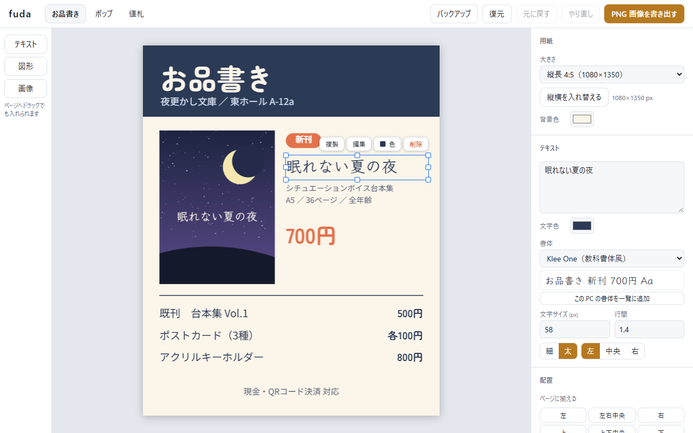
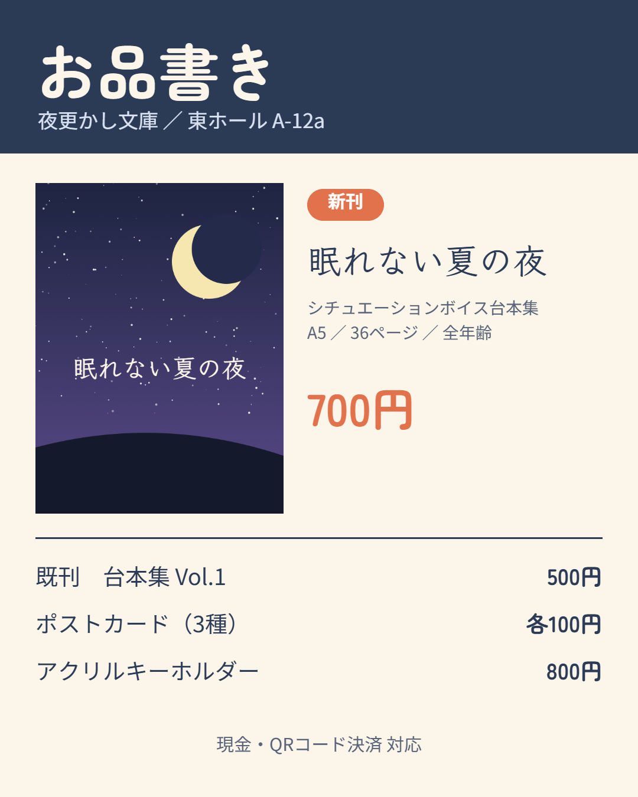
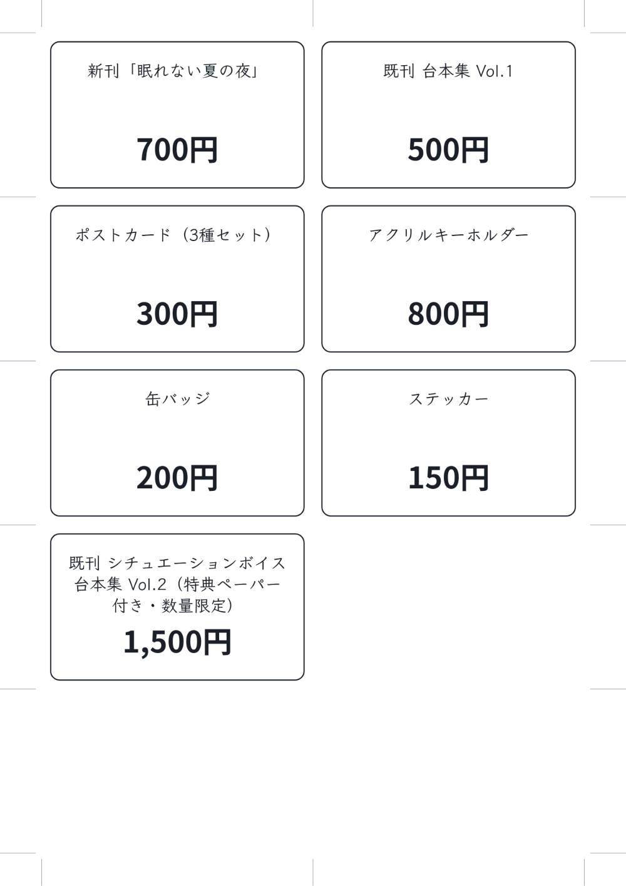
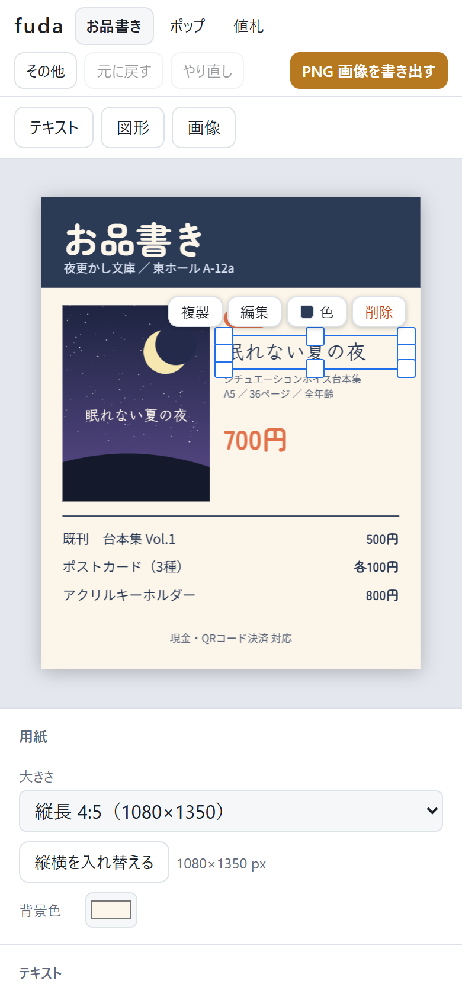
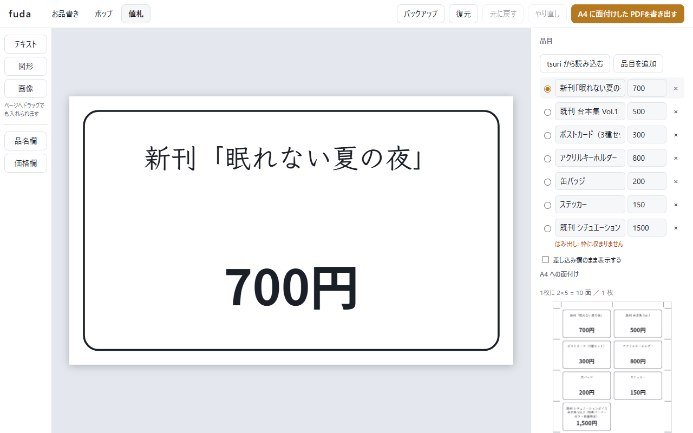
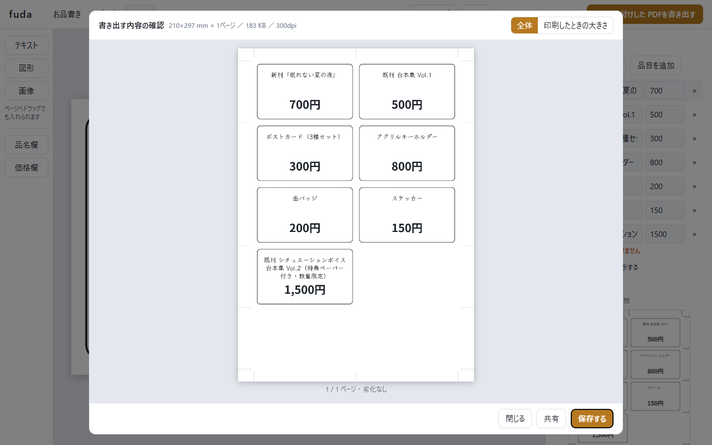

# fuda

即売会のお品書き・机上ポップ・値札を、ブラウザの中だけで作るエディタ。

**アプリ:** https://tame0522works-art.github.io/fuda/ （PC とスマホのブラウザで、開くだけで使える。ホーム画面やデスクトップにアプリとして入れることもでき、入れると電波がなくても開ける）



デザインも表紙画像も端末の中（IndexedDB）にだけ保存し、どこにも送らない。
公開版は Content Security Policy で通信そのものを禁止していて、仮に送信処理が紛れ込んでもブラウザが拒否する。

## できること

| お品書き（PNG） | 値札（A4 に面付けした PDF） | スマホ |
|---|---|---|
|  |  |  |

- **3種類を作れる**
  - お品書き … SNS に載せる PNG（1080×1350・1080×1080・1920×1080 など）
  - ポップ … 机に立てる印刷用 PDF（A4 / B5 / A5 / B6）
  - 値札 … 1枚デザインして品名・価格を差し込み、A4 に面付けした PDF（名刺サイズなら10面）
- **自由に配置する**: テキスト・図形・画像を置き、ドラッグで動かす。ページの端・中央や他の要素に吸着してガイドが出る。まとめて選んで揃える・等間隔に並べる
- **その場で書き換える**: 文字をダブルクリック（スマホは「編集」）すると、ページ上の文字の位置にそのまま入力欄が重なる
- **書体を選ぶ**: 標準のゴシック・明朝に、無料フォント6書体（丸ゴシック・太い見出し・手書き風・デザイン）を同梱。Chrome / Edge では PC の書体も使える
- **書き出す前に確かめる**: 保存する前に、書き出すものそのものを確認画面で見せる。「スマホの画面幅」「印刷したときの大きさ」に切り替えて、文字が読めるかを確かめられる。スマホでは SNS などへそのまま共有できる
- **値札のはみ出しを知らせる**: 品名の長い品目だけ枠からはみ出すので、品目一覧で印を付ける
- **tsuri と品目を共有する**: [tsuri](https://github.com/tame0522works-art/tsuri)（即売会の頒布管理）のバックアップを読み込むと、品名と価格が値札の品目になる
- **バックアップ**: 3つのデザイン・品目・画像を1つのファイルに書き出し、別の端末で戻せる
- **アプリとして入れる**: Chrome・Edge・Android では「アプリとして入れる」、iPhone では Safari の共有メニューの「ホーム画面に追加」から。入れたあとは電波がなくても開ける

| 値札の編集 | 書き出す前の確認 |
|---|---|
|  |  |

## 使ってみて直したこと

作者が仮の内容でお品書きを作りながら試用し、詰まったところとその対応を [docs/trial-log.md](docs/trial-log.md) に残している。

- **行を増やす方法が分からなかった** → 要素を選ぶとそばに「複製・編集・削除」を出し、複製は元のすぐ下に同じ書式で置くようにした
- **画像の入れ方が分かりにくかった** → ページへのドラッグ＆ドロップに対応し、落とした位置に置くようにした
- **文字の色を変える場所が分かりにくい** → そばのボタン列に「色」を足し、右パネルでも文字色を上の方へ移した
- **使えるフォントを増やしたい** → 無料フォント6書体を同梱し、PC の書体も選べるようにした
- **初期のお品書きに「はみ出し」と出る** → 行間の余白まで数えていた誤検出。文字の下端で判定するようにした
- **書き出す前にプレビューを見たい** → 保存する前の確認画面を作った
- **スマホでも使いたい** → ページを画面上部に残したまま設定をスクロールできる配置にし、つまみ・当たり判定・案内を指の操作に合わせた
- **1920×1080 に対応してほしい** → 用紙に足した。あわせて、縦長のお品書きから「横長」を選ぶと縦長のままになる不具合を直した
- **アプリのように入れたい** → PWA にした。電波がなくても開け、新しい版が届くと「更新する」で切り替えられる
- **（気づいたこと）iPhone の Safari では、7日間開かないとデザインが消えることがある** → バックアップしていない編集が続くと、バックアップを促す知らせを出すようにした
- **（気づいたこと）電波がないときに、まだ使っていない書体を選ぶと黙って代わりの書体になる** → 知らせを出し、電波が戻ったら「開き直す」で使えるようにした
- **値札のプレビューができない** → 品目が0件だと確認画面を開いていなかった。差し込み欄のまま見せ、品目の追加を案内するようにした

## 作りの要点

### 3種類の出力を1つの描画関数で描く

お品書き・ポップ・値札は、どれも「1枚のページに要素を自由に置いたもの」として扱う。違うのは用紙の単位（画像は px、印刷物は mm）と書き出し方だけ。
画面表示・PNG・PDF・値札の面付けは、すべて [`drawDoc`](src/render.ts) という1つの関数を通る。

### 画面と書き出しで改行位置をずらさない

文字の折り返しは、描く倍率に関係なく常に 100px 基準で測る。
画面（小さく描く）と 300dpi の書き出し（大きく描く）ではフォントのヒンティングで幅が微妙に変わり、倍率ごとに測ると「画面では1行だったのに印刷すると2行」が起きるため。
折り返しは日本語の禁則（句読点のぶら下げ・開き括弧の追い出し）を守り、`1200円` や `Vol2` のような英数字の並びは途中で折らない（[`wrap.ts`](src/wrap.ts)）。

### PDF はライブラリを使わず自前で組む

必要なのは「1ページに1枚の画像を全面に貼った PDF」だけなので、仕様の最小限を自前で書いた（[`pdf.ts`](src/pdf.ts)）。
文字と図形だけのページは可逆圧縮（FlateDecode。ブラウザ標準の `CompressionStream`）で埋め込み、文字の輪郭をにじませない。
写真を含むページだけは JPEG も作って比べ、可逆圧縮が JPEG の2倍を超えるときは JPEG（DCTDecode）にする。写真全面のポップが 7 MB 前後になったための対応（下の「書き出しの実測」）。

### 通信をブラウザに禁止させる

「送る処理を書いていない」だけに頼らず、公開版の HTML に CSP を入れて、ブラウザに通信そのものを拒否させている（[`vite.config.ts`](vite.config.ts)）。

```
default-src 'none'; script-src 'self'; style-src 'self'; font-src 'self' data:; img-src 'self' data:;
connect-src 'none'; manifest-src 'self'; worker-src 'self'; base-uri 'none'; form-action 'none'; object-src 'none'
```

`connect-src 'none'` で fetch・XHR・WebSocket・sendBeacon はすべて拒否される。公開用ビルドで、外部への送信が拒否されること、フォント・画像・PDF・バックアップが違反なく動くことを確かめた。
GitHub Pages はレスポンスヘッダーを設定できないので `<meta>` で入れている（そのため `frame-ancestors` は指定できない）。開発サーバーは更新の通知に WebSocket を使うので、ビルドのときだけ入れる。

### 書体は使う文字の分だけ読み込む

日本語フォントは1書体で数 MB ある。同梱フォントは文字のまとまりごとに分割した woff2 を置き、実際に使う文字の分だけ読み込む（見本のお品書きなら1書体あたり十数ファイル）。
canvas は自分では書体の読み込みを起こさないので、描く前に使う文字を渡して読み込み、届いたら描き直す。書き出しは読み込みが終わってから描くので、届く前の代わりの書体で刷られることはない。
PC の書体を使ったデザインを、その書体のない端末で開くと黙って代わりの書体になる。同じ文字列を「その書体＋代わり」と「代わりだけ」で測り比べ、幅が変わらなければ「入っていない」として知らせる。

### 選ぶ・つかむの当たり判定

塗りのない図形（外枠など）は線の近くでしかつかめないようにした。内側のどこを押しても外枠をつかんでしまい、囲み選択を始められなかったため。
囲み選択はすっぽり入った要素だけを選ぶ（大きな外枠まで拾わない）。吸着や当たり判定の幅は用紙の単位ではなく画面上の距離で決め、mm の値札を拡大していても px のお品書きでも同じ手触りにした。指で操作する端末では幅を広げる。

### アプリとして入れる（PWA）

Service Worker で、本体（HTML・JS・CSS・アイコンなど 11 ファイル）をインストール時に取り込み、電波がなくても開けるようにした（[`sw-template.js`](sw-template.js)、ビルド時に [`vite.config.ts`](vite.config.ts) がファイル一覧を埋める）。
同梱フォントは約930ファイル・16MB あり、全部取り込むとスマホには重いので、一度使った分だけを版をまたいで残す。
電波がないときに、まだ使っていない書体を選ぶと読み込めない。ブラウザは一度失敗した書体を同じ画面のままでは読み込み直さないので、読み込めなかったことを知らせ、電波が戻ったら「開き直す」を出す。
アプリとして入れると開きっぱなしになりやすく、新しい版になかなか切り替わらない。新しい版が届いたら画面に知らせを出し、「更新する」で切り替える（直前の編集の自動保存が終わるのを待ってから読み直す）。
CSP は通信を禁止したまま、manifest と Service Worker だけを自分のサイトから読めるようにしている（`manifest-src 'self'; worker-src 'self'`）。
画面操作のテストでは、配信サーバーそのものを止めて開けることを確かめている（ブラウザの「オフライン」設定は Service Worker の通信には効かないことがあるため）。

### バックアップは外から来るファイルとして読む

バックアップ（JSON）を読み込むときは、知っている項目だけを型と値の範囲を確かめながら組み立て直し、読めなかった場所を「『お品書き』の2番目の要素の文字サイズが読めません」のように示して断る（[`backup.ts`](src/backup.ts)）。
今のデータとの入れ替えは1つの transaction で行い、途中で失敗しても半端に混ざらない。

デザインはブラウザの中にしかなく、iPhone・iPad の Safari は、ホーム画面に追加していないサイトのデータを7日間使わないと消すことがある。
そこで「バックアップしていない編集がいつから続いているか」を記録し、Safari（ホーム画面に追加していないとき）では編集を10分続けたら、それ以外の端末では3日たったら、バックアップを促す（[`reminder.ts`](src/reminder.ts)）。

## 書き出しの実測

2026-10-05、AMD Ryzen 7 5700X ／ Chrome 152（計測ページのタブは裏に置いた状態）、開発サーバー上。
見本デザインは初期表示のもの（文字と図形のみ）。写真は 3840×2400 の CG 2枚（なめらかなもの・粒状の質感があるもの）を A4 全面に敷いた。各条件で1回空打ちしたあと5回測った中央値（カッコ内は最小〜最大）。

| 対象 | 出力 | 時間 | サイズ |
|---|---|---|---|
| お品書き | PNG 1080×1350 | 55 ms（24〜86） | 104 KB |
| ポップ A4 | PDF 300dpi 1ページ | 203 ms（188〜205） | 85 KB |
| ポップ A5 | PDF 300dpi 1ページ | 103 ms（99〜104） | 57 KB |
| 値札 名刺サイズ 10品目 | PDF A4 1枚 | 224 ms（213〜230） | 197 KB |
| 値札 名刺サイズ 50品目 | PDF A4 5枚 | 1060 ms（1048〜1144） | 966 KB |
| ポップ A4・写真全面（なめらか） | PDF 300dpi 1ページ | 1151 ms（1137〜1218） | 711 KB |
| ポップ A4・写真全面（粒状） | PDF 300dpi 1ページ | 1168 ms（1151〜1178） | 894 KB |

- **値札は A4 1枚あたり約 0.2 秒・約 200 KB で、枚数にほぼ比例する。**
- **文字と図形だけのページは、可逆圧縮のほうが JPEG より小さい。** 見本のポップ A4 を JPEG（品質0.92）にすると 139 KB で、可逆圧縮の 85 KB より大きい。べた塗りが多いと可逆圧縮がよく効く。
- **写真のページは逆で、可逆圧縮だと JPEG の約8〜10倍になった。** すべて可逆圧縮だったころは、写真全面のポップ A4 が 6.9 MB ／ 7.4 MB あった。写真のページだけ JPEG に切り替えて 711 KB ／ 894 KB になった。
- **写真入りの書き出しは約 1.2 秒かかる。** 大半はブラウザの JPEG 作成（約 1.1 秒）。可逆圧縮（約 0.55 秒）と同時に走らせ、順番に待っていたときの 1.55 秒から短くした。書き出し中は画面が止まるが、1秒強なので今は Worker に移していない。

測り直すときは `npm run dev` で開発サーバーを起動し、`/bench.html` を開いて「計測する」を押す（このページは本番ビルドに含めない）。表紙画像を選んでから測ると、写真を全面に敷いたポップも測れる。

## 開発

```bash
npm install
npm run dev
```

```bash
npm run check         # 折り返し・面付け・PDF の構造・tsuri の読み込み・吸着・要素を足す位置・用紙の向き・バックアップの往復・複数選択の操作・バックアップの知らせを検証
npm run e2e           # 画面操作のテスト（公開と同じ設定でビルドし、ヘッドレスの Edge / Chrome で操作する）
npm run build
npm run screenshots   # README の画像を撮り直す（開発サーバーを起動しておく）
```

`npm run e2e` は [`tools/e2e.ts`](tools/e2e.ts)。CSP 入りのビルドをローカルで配信し、DevTools Protocol で本物のマウス・キーボード・タッチ・ファイル選択を送る。
試用で見つかった不具合を中心に、選択とドラッグと元に戻す、外枠の内側からの囲み選択、その場での書き換え、用紙の向き、確認画面中のショートカット停止、PNG・PDF・バックアップが実際にファイルとして保存されること、スマホ幅ではみ出さないこと、バックアップを促す知らせ、アプリとして入れられること、新しい版への切り替え、電波がなくても開けること、電波がないときの書体の知らせを確かめる（16件、約40秒）。
直した不具合（「横長」が縦長になる、確認画面中の Delete で要素が消える）をわざと戻すと、対応するテストが失敗することも確かめた。

`main` に push すると、GitHub Actions が lint・検証・画面操作のテスト・ビルドを通したうえで GitHub Pages に公開する（[`.github/workflows/pages.yml`](.github/workflows/pages.yml)）。

README の画像は [`tools/screenshots.ts`](tools/screenshots.ts) で撮っている。Edge（なければ Chrome）を画面なしで起動し、Chrome DevTools Protocol で見本のデザインを入れて要素を選び、確認画面を開くまでを毎回同じ手順で行う。普段のブラウザのデータには触れない（一時プロファイルを使い、終わったら消す）。
見本のお品書きのサークル名・スペース番号は架空のもの。新刊は作者の台本「眠れない夏の夜」。表紙の絵はスクリプトの中で描いている。

## 同梱フォント

いずれも SIL Open Font License 1.1。ライセンス文は [public/licenses/fonts.txt](public/licenses/fonts.txt)（公開版では `/licenses/fonts.txt`）。

| 系統 | 書体 |
|---|---|
| 丸ゴシック | Zen Maru Gothic |
| 太い見出し | Dela Gothic One |
| 手書き風 | Klee One（教科書体風）、Yomogi（ペン字風） |
| デザイン | DotGothic16（レトロ）、RocknRoll One（ポップ） |
